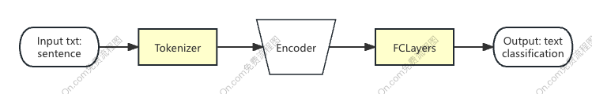

# HumanLanguageTechnologyProject
This the repo for the Human Language Technology course final project, group 4

# Dataset 
To download the dataset go to this link: 
https://drive.google.com/drive/folders/0Bz8a_Dbh9Qhbfll6bVpmNUtUcFdjYmF2SEpmZUZUcVNiMUw1TWN6RDV3a0JHT3kxLVhVR2M?resourcekey=0-TLwzfR2O-D2aPitmn5o9VQ and look for file:  amazon_review_full_csv.tar.gz

# Analyzing product reviews using transformers(draft)
This problem requires us to train a sentiment classification model using transformer-based encoders like BERT (Bidirectional Encoder Representations from Transformers), introduced [here](https://arxiv.org/abs/1810.04805). Specifically, we will parse product reviews and classify their ratings (according to whether they are 1, 2, 3, 4 or 5.)

We can consider the [Huggingface transformers library](https://github.com/huggingface/transformers) to load a pre-trained BERT model to compute text embeddings, and append this with an fully-connected neural network model or any other classification model to perform sentiment classification.

One possible choice is the [bert-base-uncased](https://huggingface.co/bert-base-uncased) model from Hugging Face, which can be loaded through the `transformers` library.

# Model(draft)
In this part, I briefly describe the model architecture to address the sentiment classification task. There are several popular pre-trained language model encoders to solve this problem, such as BERTbase, DistilBERT, and Roberta. Encoders are a great advantage as they allow us to compress the text into a latent space vector, valid for several tasks.

I developed a general architecture of the model below:
